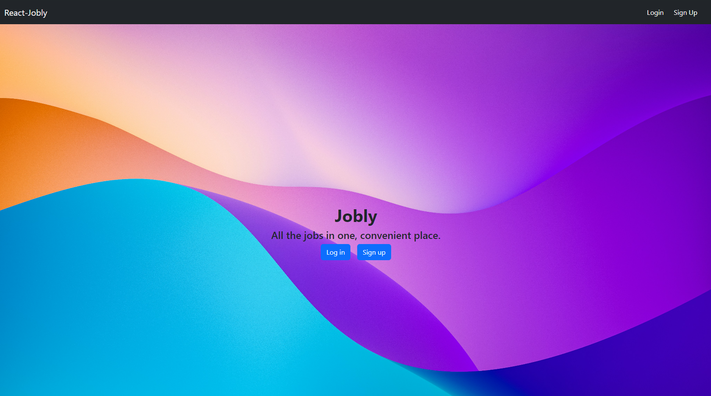

# React Jobly

## About
React-Jobly is a mock job board built with React for the frontend, express.js and node.js for the backend, and postgreSQL for our database. This project is intended to practice developing frontend UI using React as part of the Springboard Software Engineering Career Track curriculum. Vite was used to setup the frontend part. Testing was done with Vitest. Bootstrap was also used to style the web pages.

Try out at: [React Jobly](https://react-jobly-8g9y.onrender.com/)